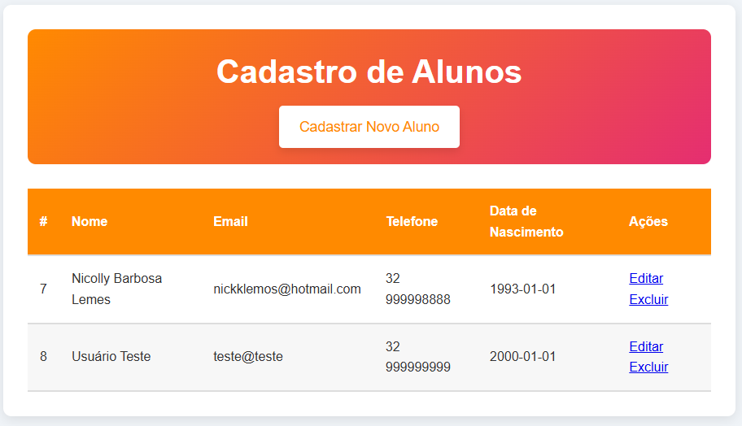
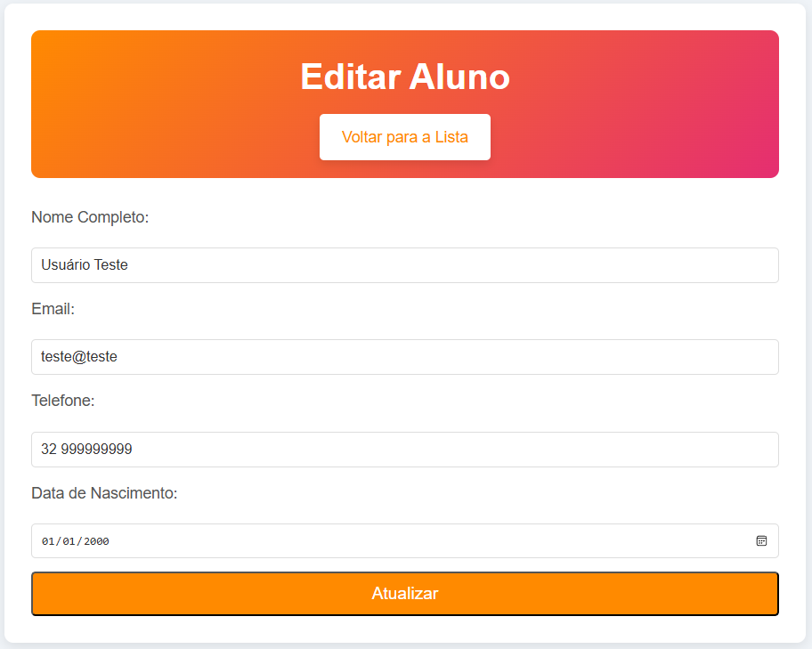

# Cadastro de Alunos

## Visão Geral do Projeto

Este projeto consiste em um sistema de cadastro de alunos, desenvolvido em **PHP**, **MySQL**, **HTML**, e **CSS**. O sistema possui a funcionalidade completa de **CRUD** (Criar, Ler, Atualizar, Excluir), permitindo cadastrar alunos, editar seus dados, exibir a lista de alunos e excluir registros.

### Funcionalidades Principais:
- Cadastro de alunos (nome, email, telefone, data de nascimento).
- Exibição da lista de alunos cadastrados.
- Edição dos dados dos alunos.
- Exclusão de alunos.

---

## Tecnologias Utilizadas

- **PHP**: Para manipulação do backend, conexão com o banco de dados e execução das operações CRUD.
- **MySQL**: Para armazenar e gerenciar os dados dos alunos.
- **HTML**: Para a estrutura da interface do usuário.
- **CSS**: Para estilização da interface do usuário.
- **XAMPP**: Ambiente de desenvolvimento local para rodar o servidor PHP e o MySQL.

---

## Estrutura de Arquivos

A estrutura de arquivos do projeto é a seguinte:

/cadastro_alunos
    /css
        - style.css
    /includes
        - db.php
        - db.sql
    /delete.php
    /editar.php
    /index.php
    /cadastro.php
    /insert.php
    /update.php

- **`/css/style.css`**: Arquivo de estilo que define a aparência do site.
- **`/includes/db.sql`**: Arquivo responsável pela criação do banco de dados e tabela.
- **`/includes/db.php`**: Arquivo responsável pela conexão com o banco de dados.
- **`/delete.php`**: Arquivo responsável pela exclusão de alunos.
- **`/editar.php`**: Arquivo que exibe o formulário para edição dos dados dos alunos.
- **`/index.php`**: Página principal, onde a lista de alunos é exibida.
- **`/cadastro.php`**: Página para o cadastro de novos alunos.
- **`/insert.php`**: Arquivo que processa o cadastro de novos alunos.
- **`/update.php`**: Arquivo que processa a atualização dos dados de um aluno.

---

## Instalação e Configuração

1. Instale o **XAMPP** e inicie o Apache e o MySQL.
2. Crie o banco de dados **`cadastro_alunos`** e execute o script de criação da tabela, que está no arquivo **`includes/db.sql`**.
3. Coloque os arquivos do projeto na pasta **`htdocs`** dentro do diretório onde o XAMPP foi instalado.
4. Acesse o projeto pelo navegador em **`http://localhost/cadastro_alunos/index.php`**.

---

## Como Usar

1. **Cadastro de Alunos**: Acesse `cadastro.php` para cadastrar novos alunos.
2. **Visualizar Alunos**: Acesse `index.php` para ver a lista de alunos cadastrados.
3. **Editar Alunos**: Clique no link de edição na lista para alterar os dados de um aluno.
4. **Excluir Alunos**: Clique no link de exclusão na lista para remover um aluno.

---

## Prints das Telas

1. **Tela de Lista de Alunos**:

    

2. **Tela de Cadastro de Alunos**:

    

3. **Tela de Edição de Alunos**:

    

---

## Licença

Este projeto está licenciado sob a **MIT License**.
